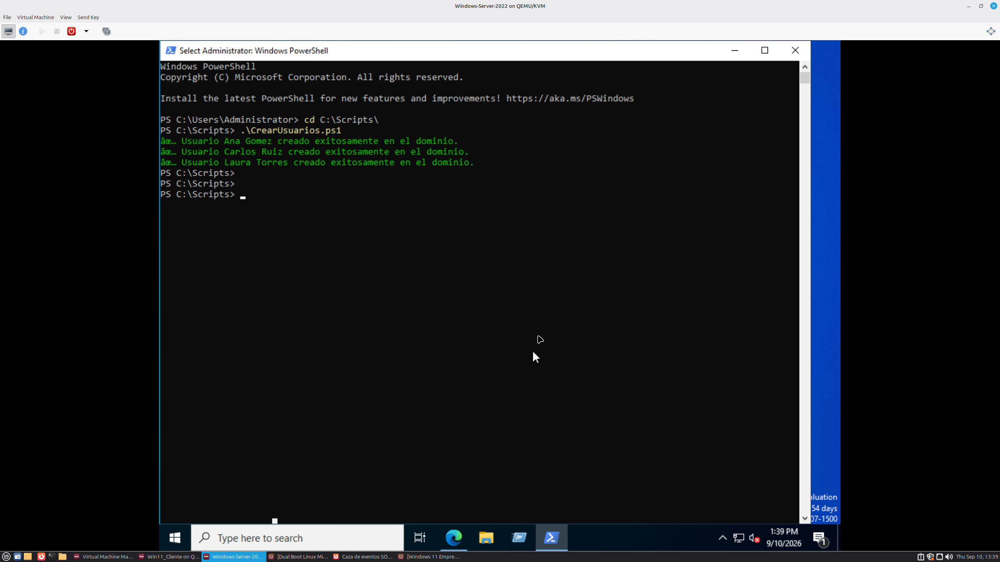
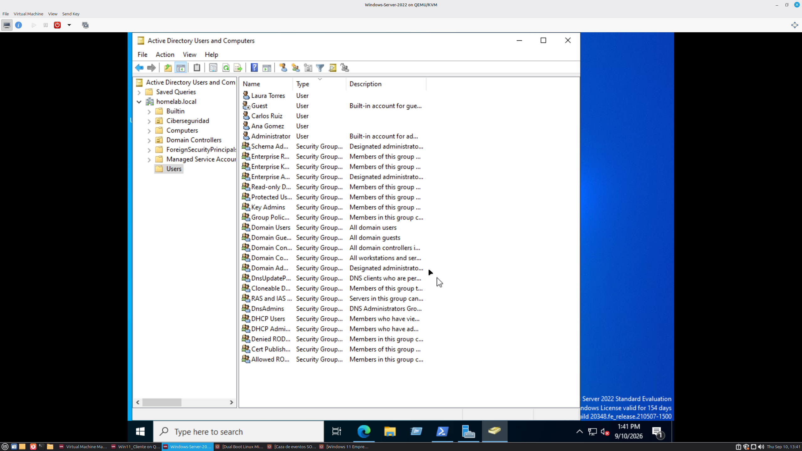
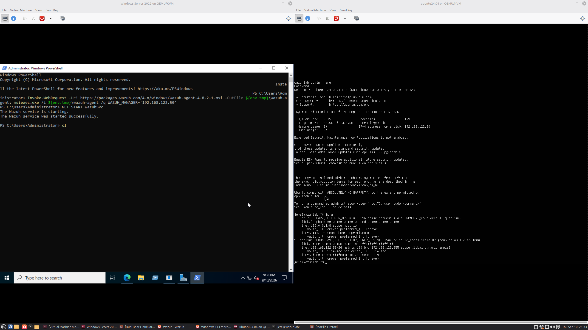
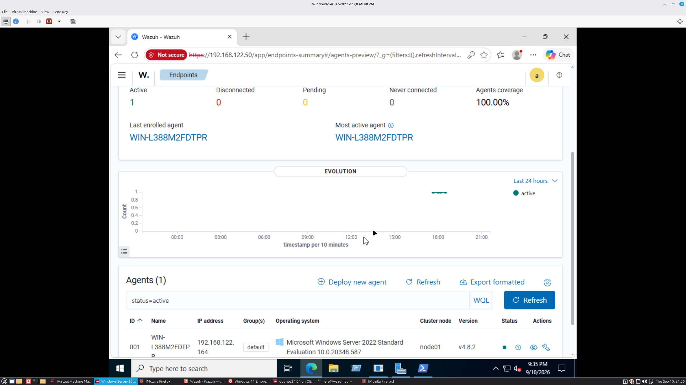
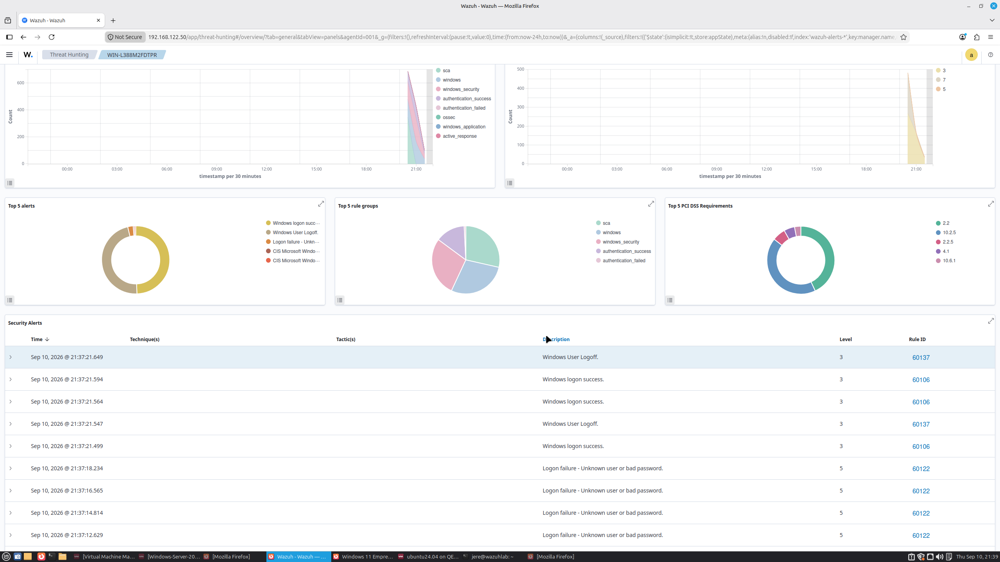
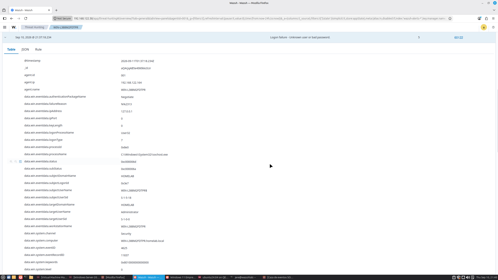

# Corporate IT HomeLab: Active Directory & SOC Monitoring

## Objetivo del Proyecto
Diseño e implementación de un entorno de red corporativa virtualizado "End-to-End" para practicar administración de sistemas, aplicación de políticas de grupo (GPOs) y auditoría de seguridad para Blue Team.

## Topología de la Arquitectura
*   **Host OS:** Linux Mint
*   **Hipervisor:** KVM/QEMU gestionado mediante Virt-Manager.
*   **Red Virtual:** Segmento en modo NAT (Rango `192.168.122.0/24`).
*   **Domain Controller (AD DS, DNS, DHCP):** Windows Server 2022 (IP Estática: `192.168.122.164`).
*   **Endpoint Cliente:** Windows 11 Enterprise (Hostname: `WS-CLIENTE01`).

## Servicios Core y Configuraciones Aplicadas
### 1. **Identity & Access Management (IAM):** Creación del bosque y dominio raíz (`homelab.local`). Diseño lógico con OUs y usuarios de prueba aplicando el Principio de Menor Privilegio (PoLP).
### 2. **Automatización con GPOs:**
   * **Mapeo de Unidades:** Despliegue de políticas (Preferences) para mapear automáticamente una ruta UNC compartida (SMB/NTFS de Solo Lectura) a la unidad Z: del cliente.
   * **Auditoría de Seguridad:** Configuración de *Advanced Audit Policies* a nivel de dominio para rastrear intentos de Logon y Management de cuentas (Success/Failure).

### 3. Automatización de Aprovisionamiento de Identidades (PowerShell)
Para optimizar el alta de empleados y anular el margen de error humano, desarrollé un script de automatización ('CrearUsuarios.ps1').
* **Funcionamiento:** El script importa el módulo de Active Directory, ingiere una base de datos de usuarios estructurada en un archivo CSV y ejecuta un bucle 'foreach' para el aprovisionamiento masivo de las cuentas.
* **Seguridad:** Las contraseñas temporales se inyectan utilizando el cmdlet 'ConvertTo-SecureString' para evitar la transmisión y almacenamiento de credenciales en texto plano.

*(Evidencia de ejecución en PowerShell y validación en ADUC)*

## Fase 2: Centro de Operaciones de Seguridad (SOC con Wazuh)

### Descripción del Proyecto
Este proyecto documenta el despliegue y configuración de un entorno de Centro de Operaciones de Seguridad (SOC) en un laboratorio virtualizado. El objetivo principal fue instalar **Wazuh SIEM (All-in-one)** para monitorear, detectar y auditar eventos de seguridad en un **Windows Server con Active Directory**.

Este laboratorio simula un entorno corporativo real, enfocándose no solo en el despliegue, sino en la resolución de problemas de infraestructura (troubleshooting) y la cacería de amenazas (Threat Hunting).

### Arquitectura e Infraestructura
El laboratorio fue construido sobre **QEMU/KVM (Virt-Manager)** utilizando una máquina host con Linux.
* **SIEM Server:** Ubuntu Server 24.04 LTS (Wazuh Manager, Indexer & Dashboard).
  * *Recursos:* 4 vCPUs, 4GB RAM, 30GB Disk.
* **Target / Endpoint:** Windows Server (Controlador de Dominio / Active Directory).
* **Red:** Red virtual aislada (NAT) para comunicación segura entre el agente y el servidor.

### Desafíos Técnicos y Troubleshooting
Durante el despliegue de la infraestructura, se presentaron escenarios críticos que requirieron intervención manual a nivel de sistema operativo:

1. **Gestión de Volúmenes Lógicos (LVM) en Ubuntu:** 
   * **Problema:** El instalador de Wazuh colapsó al quedarse sin espacio temporal al extraer 'filebeat'. Ubuntu Server asigna por defecto solo el 50% del disco virtual al volumen lógico (LVM).
   * **Solución:** Se realizó una expansión del disco en caliente arrebatando el espacio no asignado mediante 'lvextend -l +100%FREE' y ajustando el sistema de archivos con 'resize2fs'.
2. **Corrupción del Gestor de Paquetes (dpkg):** 
   * **Problema:** El colapso por almacenamiento dejó procesos huérfanos aferrados al puerto '1515' y rompió la base de datos de paquetes, generando el *Error 127* al intentar reiniciar los servicios de Wazuh.
   * **Solución:** Se identificaron y eliminaron los procesos zombis ('pkill -9'), se purgó la base de datos de paquetes defectuosos manipulando los scripts de control en '/var/lib/dpkg/info/', y se realizó una instalación limpia con el parámetro de sobreescritura ('-o').

### Fase Operativa y Caza de Amenazas

### 1. Despliegue del Agente (Windows Server)
Se generó el payload de instalación desde el panel de Wazuh y se inyectó en el servidor objetivo mediante ejecución silenciosa en **PowerShell**. El agente fue configurado para reportarse al nodo central de Ubuntu, logrando conectividad exitosa.

### 2. Simulación de Ataque (Fuerza Bruta / Acceso no Autorizado)
Para validar las reglas de detección, se simuló un ataque de fuerza bruta intentando acceder al Active Directory con credenciales falsas múltiples veces.

* **Táctica simulada:** Credential Access.
* **Evento Windows Capturado:** Event ID 4625 (Logon failure).

### 3. Threat Hunting & Análisis Forense
El SIEM capturó, normalizó y correlacionó los eventos instantáneamente. A través del módulo de **Threat Hunting**, se aisló la telemetría del servidor Windows y se identificó la alerta crítica (Nivel 5 - ID 60122). 

Al analizar el JSON crudo del evento, se pudo determinar la hora exacta del ataque, la terminal de origen y el nombre del usuario falso utilizado en el intento de brecha.

## Tecnologías Utilizadas
* **Seguridad:** Wazuh SIEM, OpenSearch, Filebeat.
* **Sistemas Operativos:** Linux (Ubuntu Server 24.04), Windows Server.
* **Virtualización:** QEMU/KVM, Virt-Manager.
* **Herramientas de CLI:** bash, LVM tools, systemd (journalctl), PowerShell.

## Incidentes y Troubleshooting

## Incidente 1: Conflicto de resolución DNS por Rogue DHCP
* **Síntoma:** El cliente Windows 11 no podía resolver el nombre del dominio (`homelab.local`), bloqueando el Domain Join.
* **Diagnóstico:** El servicio `dnsmasq` del host Linux, operando en la red NAT (`192.168.122.1`), actuaba como un Rogue DHCP. Respondía a las solicitudes de descubrimiento más rápido que el servidor de Windows, entregando su propio DNS.
* **Resolución:** Se aplicó un *override* en las propiedades IPv4 del adaptador de red del cliente, estableciendo estáticamente la IP del Controlador de Dominio (`192.168.122.164`) como "Preferred DNS server". Esto permitió la resolución exitosa y la unión del equipo al dominio manteniendo la salida a internet del hipervisor.

## Incidente 2: Simulación y Cacería de Eventos de Seguridad (Brute Force)
* **Síntoma:** Ataque simulado de fuerza bruta interactiva contra el usuario estándar.
* **Resolución y Monitoreo:** 
  * Se identificó el **Event ID 4625 (Failed Logon - Type 2)** de manera local en el Visor de Eventos del endpoint (Windows 11).
  * Se validó el impacto a nivel de red centralizada cazando el **Event ID 4771 (Kerberos Pre-authentication failed)** directamente en los logs de seguridad del Controlador de Dominio.

## Roadmap y Estado
* [x] Infraestructura base de Active Directory.
* [x] Automatización de creación de usuarios masiva utilizando PowerShell.
* [x] Implementación de un SIEM (Wazuh) para la centralización y recolección de los logs (Event Forwarding).
* [ ] (Futuro) Despliegue de respuestas activas (Active Response) para bloqueo automático de IPs atacantes.
